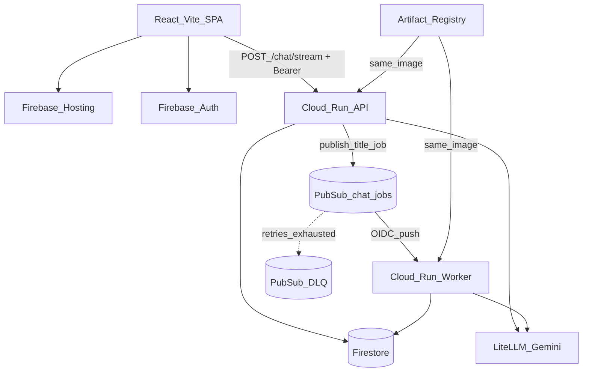

# Architecture

Split-stack Q/A chatbot: two independently deployed apps on GCP. Phase 1 (Q/A + history) and Phase 2 (SSE + Firebase Auth) are done; Phase 3 adds Pub/Sub + a private worker for one-shot session title generation.

## Components

- **Frontend:** React + Vite SPA on Firebase Hosting
- **Backend API:** FastAPI (uvicorn) on Cloud Run (`gcp-chatbot-api`)
- **Worker:** FastAPI push handler on private Cloud Run (`gcp-chatbot-worker`, same image)
- **LLM:** LiteLLM → Vertex catalog by default (`GET /models`); `LITELLM_MODEL` for title jobs
- **History:** Firestore Native (`ChatStore`) — `users/{uid}/sessions/{session_id}/messages`
- **Jobs:** Firestore `users/{uid}/jobs/{job_id}` + Pub/Sub topic `chat-jobs`
- **Auth (Phase 2):** Firebase Auth (email/password, Google, GitHub); API verifies ID tokens
- **Secrets / images:** Secret Manager, Artifact Registry

## Request flow

1. User signs in (Firebase Auth) and sends a message in the SPA.
2. Frontend `POST`s `{ session_id?, message, model? }` to Cloud Run `/chat/stream` with `Authorization: Bearer <idToken>` (SSE). Sync `POST /chat` remains for tests/non-stream clients. `model` must be on the Vertex allowlist from `GET /models`.
3. Backend verifies the ID token, loads last N messages from Firestore under that user.
4. Backend streams LiteLLM tokens as SSE `token` events; emits `session` / `done` / `error`.
5. On success, backend appends user + assistant messages to Firestore. A truncated first-user-message title is written as an immediate fallback.
6. After the **first** successful assistant turn (no prior assistant in history), the API enqueues one deterministic title job (`title:{session_id}`) when `JOBS_ENABLED=true`.
7. Pub/Sub pushes to the private worker; the worker generates a short LLM title, persists it on the session doc, and marks the job succeeded. Follow-ups and page refreshes read the stored title — they do not regenerate it.

API: `GET /health`, `GET /models`, `POST /chat`, `POST /chat/stream`, `GET /sessions`, `GET /sessions/{id}`, `DELETE /sessions/{id}`.

Worker: `GET /health`, `POST /internal/pubsub/title` (Pub/Sub only).

## Portability seams

| Concern | Interface | GCP now |
|---------|-----------|---------|
| LLM | `LLMClient` | `LiteLLMClient` (`vertex_ai/…` catalog + ADC; optional `gemini/…` API key for titles) |
| Chat history | `ChatStore` | `FirestoreChatStore` |
| Queue | `QueueClient` | `PubSubQueueClient` (or `MemoryQueueClient` locally) |
| Job status | `JobStore` | `FirestoreJobStore` |
| Frontend API host | `VITE_API_BASE_URL` | Cloud Run API URL |

Route handlers never import `google.cloud` — only `providers/` do.

## Multi-cloud map

| Capability | GCP (now) | Azure (later) | AWS (later) |
|------------|-----------|---------------|-------------|
| Backend containers | Cloud Run | Container Apps | App Runner / ECS Fargate |
| Frontend static | Firebase Hosting | Static Web Apps / Blob+CDN | Amplify / S3+CloudFront |
| LLM | LiteLLM → Gemini API key (`gemini/…`) | LiteLLM → Azure OpenAI | LiteLLM → Bedrock |
| Chat history | Firestore | Cosmos DB | DynamoDB |
| Async jobs | Pub/Sub + Cloud Run worker | Service Bus + worker | SQS + worker |
| Secrets | Secret Manager | Key Vault | Secrets Manager |
| Images | Artifact Registry | ACR | ECR |
| Auth (Phase 2) | Identity Platform / Firebase Auth | Entra ID / Easy Auth | Cognito |

Switch LLM clouds mainly via `LITELLM_MODEL` + credentials. Mirror Terraform under `infra/terraform/azure/` and `…/aws/` later.

## Decisions (ADRs)

### ADR-001: Split frontend and backend deploys

React on Firebase Hosting; FastAPI on Cloud Run — separate pipelines, CORS, multi-cloud analogs.

### ADR-002: Cloud Run over GKE / VMs

Scale-to-zero, Docker-portable, low learning cost.

### ADR-003: Firestore for chat history

Native mode only in Phase 1. SQLAlchemy/Alembic deferred until SQL is intentional.

### ADR-004: LiteLLM for chat

`LLMClient` + `LiteLLMClient`. Chat requests pick from a Vertex-only allowlist (`GET /models`); each catalog entry has its own `vertex_location`. Default / title jobs: `LITELLM_MODEL` (`vertex_ai/…` + ADC, or `gemini/…` + `LITELLM_API_KEY`). No mock LLM in the app.

### ADR-005: uv + pnpm only

Lockfile-first; no pip/npm as source of truth.

### ADR-006: uvicorn on Cloud Run

ASGI for FastAPI; Cloud Run scales instances — no gunicorn for Phase 1.

### ADR-007: Few living docs

Consolidate under `docs/` (`architecture`, `development`, `deploy`, `lessons`). Update in place; avoid `docs/phase-N/` folders and one-file-per-tiny-topic sprawl.

### ADR-008: SSE for chat UI

Primary chat UX uses `POST /chat/stream` (`text/event-stream`) with events `session` / `token` / `done` / `error`. Sync `POST /chat` remains for tests and non-stream clients. Frontend uses `fetch` + `ReadableStream` (not `EventSource`) so `Authorization` headers work with Firebase Auth.

### ADR-009: Firebase Auth + path ownership

AuthN: Firebase Auth (email/password, Google, GitHub). FastAPI verifies ID tokens with `firebase-admin` (Google public certs + ADC; no private key / no Secret Manager for Auth). AuthZ: Firestore layout `users/{uid}/sessions/{session_id}/messages/{message_id}` — ownership is the path. Cloud Run stays publicly invokable; the API rejects missing/invalid tokens. Phase 1 flat `sessions/*` is not migrated.

### ADR-010: Pub/Sub push worker for session titles

Phase 3 keeps interactive chat on the API (sync + SSE). Background work uses Pub/Sub with an authenticated **push** subscription to a **private** Cloud Run worker (OIDC SA invoker — no `allUsers`). First job type is one-shot session title generation after the first successful assistant turn (history with no prior assistant message — not “empty history”). Titles are persisted on the session document; they are not regenerated on refresh. Job status lives at `users/{uid}/jobs/{job_id}` with leases for at-least-once delivery.

Worker HTTP mapping for Pub/Sub: `succeeded` / `duplicate` → 200 (ACK); `skipped` (lease held) → 503 (retry); processing errors → 500; malformed payload → 400 (retry then DLQ). OIDC `audience` is the worker Cloud Run service URI (not the `/internal/pubsub/title` path). Push `ack_deadline_seconds` matches the worker timeout and job lease (120s). `complete_job` never overwrites an already-`succeeded` record. Conversation summarization is deferred.

### ADR-011: Vertex-only chat model picker

The composer exposes a global, browser-persisted model preference. The API allowlists Vertex publisher IDs only (`vertex_ai/gemini-…`, GPT-OSS, Llama, DeepSeek, Qwen, Gemma) so chat stays on ADC / Cloud Run SA. Unknown models are HTTP 400. Title generation does not follow the picker — it uses `LITELLM_MODEL`. Open/partner MaaS models must be Enabled once in Model Garden; they are not provider API-key routes. Catalog locations follow each model card (`global` vs `us-central1`). Claude, Grok, and Mistral are omitted until Enable + quota are proven on this project.
