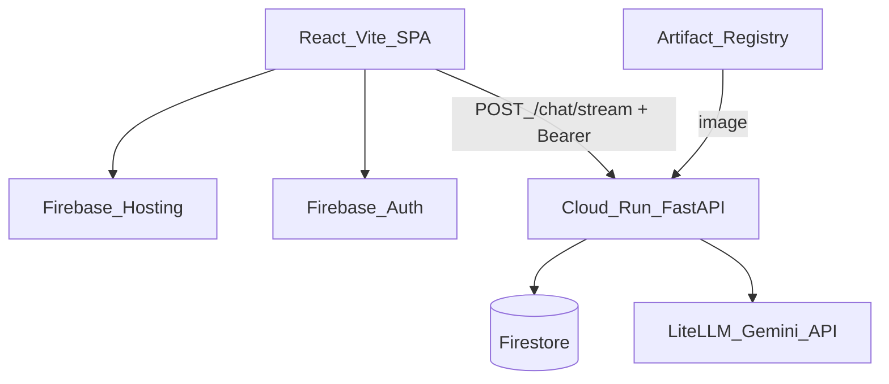

# Architecture

Split-stack Q/A chatbot: two independently deployed apps on GCP. Phase 1 (Q/A + history) is done; Phase 2 adds SSE streaming and Firebase Auth.

## Components

- **Frontend:** React + Vite SPA on Firebase Hosting
- **Backend:** FastAPI (uvicorn) on Cloud Run
- **LLM:** LiteLLM → Vertex Gemini by default (`LITELLM_MODEL`)
- **History:** Firestore Native (`ChatStore`) — Phase 2: `users/{uid}/sessions/{session_id}/messages`
- **Auth (Phase 2):** Firebase Auth (email/password, Google, GitHub); API verifies ID tokens
- **Secrets / images:** Secret Manager, Artifact Registry

## Request flow

1. User signs in (Firebase Auth) and sends a message in the SPA.
2. Frontend `POST`s `{ session_id?, message }` to Cloud Run `/chat/stream` with `Authorization: Bearer <idToken>` (SSE). Sync `POST /chat` remains for tests/non-stream clients.
3. Backend verifies the ID token, loads last N messages from Firestore under that user.
4. Backend streams LiteLLM tokens as SSE `token` events; emits `session` / `done` / `error`.
5. On success, backend appends user + assistant messages to Firestore.
6. Frontend grows the assistant message from `token` events.

API: `GET /health`, `POST /chat`, `POST /chat/stream`, `GET /sessions`, `GET /sessions/{id}`, `DELETE /sessions/{id}`.

## Portability seams

| Concern | Interface | GCP now |
|---------|-----------|---------|
| LLM | `LLMClient` | `LiteLLMClient` (`gemini/…` + API key, or `vertex_ai/…`) |
| Chat history | `ChatStore` | `FirestoreChatStore` |
| Frontend API host | `VITE_API_BASE_URL` | Cloud Run URL |

Route handlers never import `google.cloud` — only `providers/` do.

## Multi-cloud map

| Capability | GCP (now) | Azure (later) | AWS (later) |
|------------|-----------|---------------|-------------|
| Backend containers | Cloud Run | Container Apps | App Runner / ECS Fargate |
| Frontend static | Firebase Hosting | Static Web Apps / Blob+CDN | Amplify / S3+CloudFront |
| LLM | LiteLLM → Gemini API key (`gemini/…`) | LiteLLM → Azure OpenAI | LiteLLM → Bedrock |
| Chat history | Firestore | Cosmos DB | DynamoDB |
| Secrets | Secret Manager | Key Vault | Secrets Manager |
| Images | Artifact Registry | ACR | ECR |
| Auth (Phase 2) | Identity Platform / Firebase Auth | Entra ID / Easy Auth | Cognito |

Switch LLM clouds mainly via `LITELLM_MODEL` + credentials. Mirror Terraform under `infra/terraform/azure/` and `…/aws/` later.

## Decisions (ADRs)

### ADR-001: Split frontend and backend deploys

React on Firebase Hosting; FastAPI on Cloud Run — separate pipelines, CORS, multi-cloud analogs.

### ADR-002: Cloud Run over GKE / VMs

Scale-to-zero, Docker-portable, low learning cost.

### ADR-003: Firestore for chat history

Native mode only in Phase 1. SQLAlchemy/Alembic deferred until SQL is intentional.

### ADR-004: LiteLLM for chat

`LLMClient` + `LiteLLMClient`. Default Vertex: `vertex_ai/…` + ADC. API-key path: `LITELLM_MODEL` + `LITELLM_API_KEY` (+ optional `LITELLM_BASE_URL`). No mock LLM in the app.

### ADR-005: uv + pnpm only

Lockfile-first; no pip/npm as source of truth.

### ADR-006: uvicorn on Cloud Run

ASGI for FastAPI; Cloud Run scales instances — no gunicorn for Phase 1.

### ADR-007: Few living docs

Consolidate under `docs/` (`architecture`, `development`, `deploy`, `lessons`). Update in place; avoid `docs/phase-N/` folders and one-file-per-tiny-topic sprawl.

### ADR-008: SSE for chat UI

Primary chat UX uses `POST /chat/stream` (`text/event-stream`) with events `session` / `token` / `done` / `error`. Sync `POST /chat` remains for tests and non-stream clients. Frontend uses `fetch` + `ReadableStream` (not `EventSource`) so `Authorization` headers work with Firebase Auth.

### ADR-009: Firebase Auth + path ownership

AuthN: Firebase Auth (email/password, Google, GitHub). FastAPI verifies ID tokens with `firebase-admin` (Google public certs + ADC; no private key / no Secret Manager for Auth). AuthZ: Firestore layout `users/{uid}/sessions/{session_id}/messages/{message_id}` — ownership is the path. Cloud Run stays publicly invokable; the API rejects missing/invalid tokens. Phase 1 flat `sessions/*` is not migrated.

